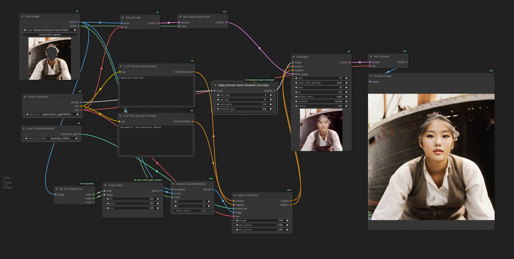

# ComfyUI-denoise-mask-scheduler
ComfyUI-denoise-mask-scheduler experimental approach involves selectively applying a denoise mask at each step during the inpainting inference process in diffusion models.

## Introduction
In inpainting tasks, the non-mask area should remain unchanged. However, this often results in visible mask boundaries. **If minor alterations to parts of the non-mask area are acceptable, this approach can be quite effective.**

At each sampling step, the denoise mask is progressively modified according to predefined rules using the `denoise_mask_function` of comfyui modelpatcher options. I refer to this process as the ***denoise mask schedule***. This schedule can include transformations like mask skipping, random masking, and morphology adjustments.

However, only the skip option is currently implemented. New schedules will be continuously added as effective ones are identified.

## Install
Download the repository and unpack into the custom_nodes folder in the ComfyUI installation directory.

Or clone via GIT, starting from ComfyUI installation directory:
```bash
cd custom_nodes
git clone https://github.com/MiddleKD/ComfyUI-denoise-mask-scheduler.git
```

## Workflows
### [Skip mask and Apply alpha](workflows/skip_and_alpha.json)

- basic inpainting

*input/basic/denoise-mask-scheduler*
- inpainting controlnet

*input/controlnet/controlnet+denoise-mask-scheduler (look at the forehead)*
